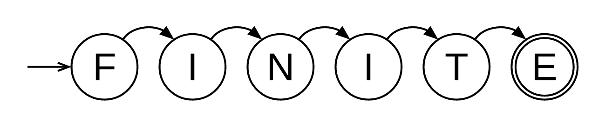
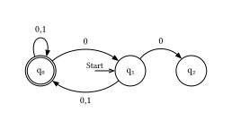

<center>



</center>

[](https://typst.app/universe/package/finite)
[](https://github.com/lilaq-project/lilaq/blob/main/LICENSE)

**finite** is a [Typst](https://github.com/typst/typst) package for rendering finite automata.

---

## Usage

Import the package from the Typst preview repository:

```typst
#import "@preview/finite:0.5.0": automaton
```

After importing the package, simply call `#automaton()` with a dictionary holding a transition table:
```typst
#import "@preview/finite:0.5.0": automaton

#automaton((
  q0: (q1:0, q0:"0,1"),
  q1: (q0:(0,1), q2:"0"),
  q2: (),
))
```

The output should look like this:
<center>

<picture>
  <source media="(prefers-color-scheme: dark)" srcset="./thumbnail-dark.svg">
  
</picture>

</center>

## Further documentation

See [manual.pdf](docs/manual.pdf) for a full manual of the package.
